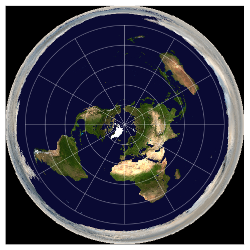
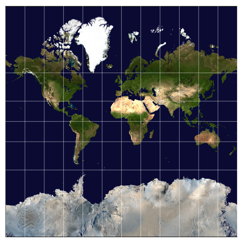

# Map Projections
## About

Custom implementations of map common map projections.

All these projections are supported with forward and inverse equations.

The forward equations are used for directly transforming data of `(longitude, latitude)` pairs.
This is for example useful for boundary data.
For a gallery of examples, see [gallery/boundaries](gallery/boundaries).

The `reproject_warp` function is used for image warping. It is a simple wrapper around `ImageTransformations.warp`.
This function uses the backwards method which requires the inverse equations.
For a gallery of examples, see [gallery/blue_marble](gallery/blue_marble) or the table below.

Caveats:
- This package does not automatically integrate with rasters. Rasters usually come with projection and dimension information. See [Rasters.jl](https://github.com/rafaqz/Rasters.jl/) for a package for reading raster data.
- This package does not support reading standard CRS formats.
- Only the spherical versions of projection equations are implemented. This is particularly relevant to the Mercator and Transverse Meractor projections. 

Coordinate example:
```julia
using MapProjections
proj = TransverseMercator(;k=1.0)
coords_src = (20.0, 30.0) # degrees
coords_dest = proj(coords_src) # (1.95e6, 3.51e6)
proj_inv = inv(proj) # InverseTransverseMercator
coords_back = proj_inv(coords_dest) # (20.0, 30.0)
```

Image warping example:
```julia
using MapProjections
using MapProjections: affine_from_bounds
using Images
using ImageTransformations: BSpline, Linear
img = load("data/Blue_Marble_2002.png")
height, width = size(img)
src_affine = affine_from_bounds(-180.0, -90.0, 180.0, 90.0, width, height)
src_proj = WorldGeodeticSystem84()
dest_proj = Robinson(;k=1.0)
width_dest, height_dest, dest_affine = 
    calculate_suggested_transform(src_proj, dest_proj, width, height, src_affine)
bilinear = BSpline(Linear())
out_img = reproject_warp(
    img, (height_dest, width_dest), src_proj, dest_proj, src_affine, dest_affine
    ; method=bilinear
)
save("Robinson.png", out_img)
```

## Projections

The following is a list of supported projections.
This list is short but it includes the most common and most useful projections.

<table>
  <tr>
    <th></th>
    <th>Projection</th>
    <th>Type</th>
    <th>Example</th>
    <th>Notes</th>
  </tr>
  <tr>
    <td>1</td>
    <td>Azimuthal Equidistant</td>
    <td>Azimuthal</td>
    <td></td>
    <td>Distances from the centre are conserved. Visual comparison of distances from a central location.</td>
  </tr>
  <tr>
    <td>2</td>
    <td>Equirectangular</td>
    <td>Cylindrical</td>
    <td></td>
    <td>Distances along meridians are conserved. Standard data sharing format.</td>
  </tr>
  <tr>
    <td>3</td>
    <td>Cylindrical Equal Area</td>
    <td>Cylindrical</td>
    <td></td>
    <td>Areas are conserved.</td>
  </tr>
  <tr>
    <td>4</td>
    <td>Mercator</td>
    <td>Cylindrical</td>
    <td></td>
    <td>Conformal map. Lines of constant bearing are straight which aids navigation. Not recommended for global representations.</td>
  </tr>
  <tr>
    <td>5</td>
    <td>Orthographic</td>
    <td>Azimuthal</td>
    <td></td>
    <td>The view from space.</td>
  </tr>
  <tr>
    <td>6</td>
    <td>Robinson</td>
    <td>Pseudo cylindrical</td>
    <td></td>
    <td>Global representations.</td>
  </tr>
  <tr>
    <td>7</td>
    <td>Transverse Mercator</td>
    <td>Cylindrical</td>
    <td></td>
    <td>Conformal map. Distances along the central meridian are conserved. Commonly used for correcting local distortions within ±15° of the central meridian.</td>
  </tr>
  <tr>
    <td>7</td>
    <td>Transverse Mercator<br>(Gauss–Krüger)</td>
    <td>Cylindrical</td>
    <td></td>
    <td>An ellipsoidal version of the transverse Mercator. The Gauss–Krüger approximation equations are used. Because of their numerical instability it is not recommended for more than 45° on either side of the central meridian.
    While the exact solution has a finite map, these approximations tend to infinity at the poles.</td>
  </tr>
</table>

## Local development (optional)

```julia-repl
julia> ] # enter package mode
(@v1.x) pkg> dev path/to/MapProjections.jl
(@v1.x) pkg> status # verify installations
```

## Generate gallery

The scripts require additional packages.
Data needs to be downloaded to the [data](./data) folder.
See [Data Sources](#data-sources).

Once these have been downloaded, run the following:
```bash
cd scripts
julia --project=".." --threads auto plot_boundary_projections.jl
julia --project=".." --threads auto plot_image_projections.jl
```

## Data Sources

The data sources required to generate the maps are purposely not included to reduce this repository's size.
They can be downloaded directly from the sources instead.

- Simplified country boundaries by Natural Earth (~9.3MB) from https://www.naturalearthdata.com/downloads/10m-cultural-vectors/. 
- Detailed country boundaries (~100MB) from https://www.geoboundaries.org/. 
Reference: Runfola, D. et al. (2020) geoBoundaries: A global database of political administrative boundaries. PLoS ONE 15(4): e0231866. https://doi.org/10.1371/journal.pone.0231866
- Blue_Marble_2002.png 2560x1280 (~2.3MB) from https://en.wikipedia.org/wiki/File:Blue_Marble_2002.png. Larger resolutions available.
Reference: NASA Goddard Space Flight Center Image by Reto Stöckli (land surface, shallow water, clouds). Enhancements by Robert Simmon (ocean color, compositing, 3D globes, animation). Data and technical support: MODIS Land Group; MODIS Science Data Support Team; MODIS Atmosphere Group; MODIS Ocean Group Additional data: USGS EROS Data Center (topography); USGS Terrestrial Remote Sensing Flagstaff Field Center (Antarctica); Defense Meteorological Satellite Program (city lights). 

## Known issues

This is a list of known issues.
Many of them are a result of edge behaviour near poles and at singularities.

- Holes are currently not supported in `Plots.Shape`. The scripts only plot the outline of holes. This is for example evident with Lesotho which is effectively plotted twice: once in South Africa and once for Lesotho itself.
- Azimuthal equidistant:
  - Antarctica is inverted for `84.1°<lat0<90°`. A fix is implemented for the common use case of 90°.
- Robinson: 
  - Boundary maps: country polygons need to be split for `long0≠0`.
  - Inverse equations do not give the desired results for `long0≠0`. A fix is to bound the longitude to between -180° and 180° but this creates continues maps. A recommendation is instead to shift the centre of image using `MapProjections.recentre`.
- Tranverse Mercator:
  - Extended boundary maps have artifacts for `-171°<long0<-140°`. The artifacts lie outside the recommended range of ±15°.
